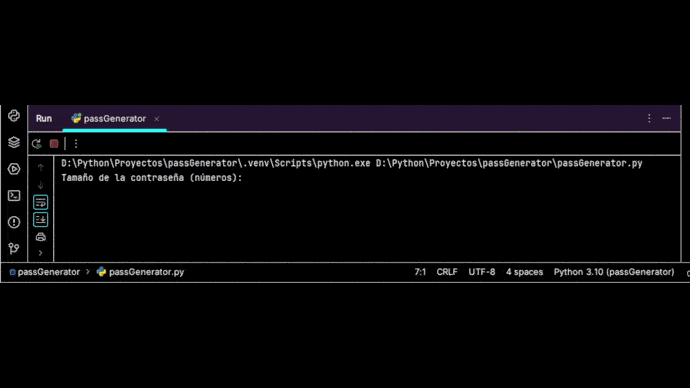

## Generador de contraseñas en Python.

Genera contraseñas según una longitud dada por el usuario. Utiliza letras mayúsculas/minúsculas, números y signos de puntuación.

**No se recomienda el uso de las contraseñas generadas.**

>Primera versión del código.
>
>Estructura básica.